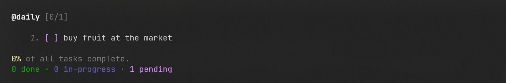
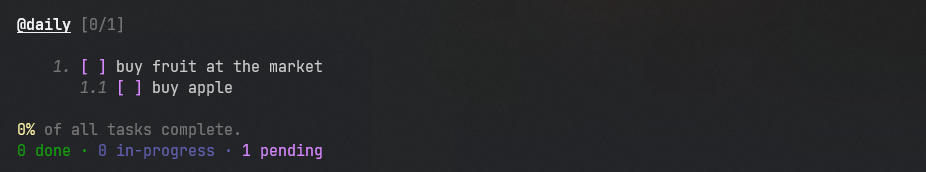
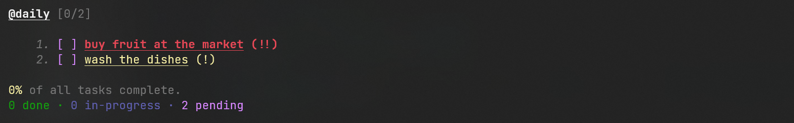
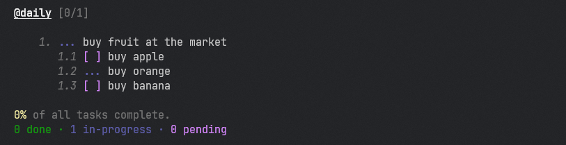
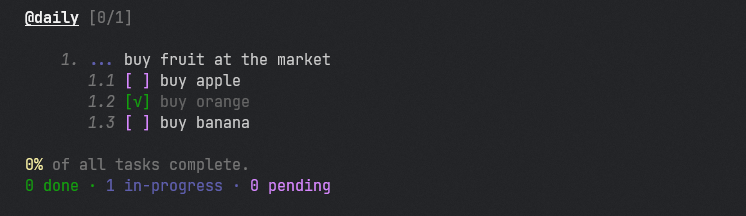
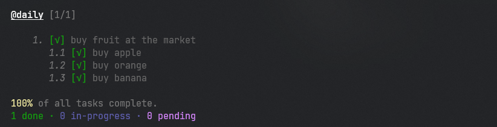

<p align="center">
    
</p>
<h3 align="center">
    Manage your tasks via the command line
</h3>

<p align="center">
    <a href="#">
        
    </a>
    <a href="#">
        
    </a>
    <a href="https://dotnet.microsoft.com/">
        
    </a>
    <a href="https://github.com/iuryferreira/">
        
    </a>


</p>


<p align="center" style="font-size:10px">Não fala inglês? veja a documentação em português <a href="README.md">aqui</a>.</p>

<br>
Tasky is a task manager made for command lines, bringing the possibility for the user to organize himself in a simple way just using his terminal and a keyboard.
It is cross-platform and can be used both on Windows with Poweshell/CMD or on linux with Bash/Fish/Zsh among others.


## Usage

After having downloaded and executed the installation script, just open the terminal and execute the application commands, 
which can be consulted with the command `tasky --help`. 

After downloading and executing the installation script, just open the terminal and execute the application's commands, which can be consulted with the command tasky --help. Through the commands you will be able to add, remove, start, complete, change priority and edit your tasks. 
We have complete management from the command line. 

### Add

To add a task you need to run the `add` command. You will also need to inform the name of the board that your task will be inserted, and if it doesn't exist, it will be created automatically.
See the example below:

```powershell
tasky add "buy fruit at the market" --board "daily"
```
The terminal will display:



#### Step

You can also add steps to your task, defining each step you will need to take to complete it. It's one more way to organize and divide tasks. To define a step you need to have added a task and inform its id through the `--step-of` parameter.  See the example below:

```powershell
# Create Task
tasky add "buy fruit at the market" --board "daily" # Let's consider the id as 1

# Create Step
tasky add "buy apple" --board "daily" --step-of 1
```
The terminal will display:



#### Priority

You can also set a priority for your task or step when you try to add it. It can be normal (default), medium and high. See the example below:

```powershell
tasky add "buy fruit at the market" --board "daily" --priority high
```
The terminal will display:



High priority is in red and medium is in yellow.

### Begin

You can start a task or step through the `begin` command. For this you need to inform the id and the task/step board. See the example below:

```powershell
# This will start the first task of the daily board
tasky begin 1 --board daily

# This will start the second step of the first task of the board daily
tasky begin 1.2 --board daily
```
When it starts, the board indicates which tasks are in progress, see the terminal output below:



### Done

You can end a task through the `done` command. For this you need to inform the id and the task/step board.  See the example below:

```powershell

# This will end the second step of the first task of the board daily
tasky done 1.2 --board daily
```

The terminal will display:



If you finish the task and there are still incomplete steps, they will all be marked as complete. See below:

```powershell
# This will end the first task and yours steps of the daily board
tasky done 1 --board daily
```

When it starts, the board indicates which tasks are in progress, see the terminal output below:



### Improvements:

- Undo e redo last operation
- Log operations